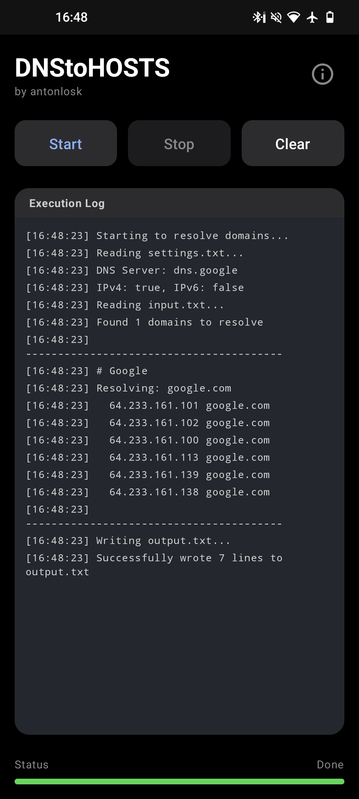

```markdown
# DNStoHOSTS

**DNStoHOSTS** — это мощная и минималистичная утилита для Android, предназначенная для массового резолвинга доменных имен в IP-адреса через протокол **DNS over HTTPS (DoH)**.

Приложение разработано в современном стиле **Android 16** (Material 3), поддерживает динамические иконки (Monet) и использует эффективные бинарные DNS-запросы (RFC 1035) для максимальной производительности и экономии трафика.

---

<p align="center">
  <!-- Сюда можно вставить ссылку на скриншот, если загрузишь его в репозиторий -->
  <!--  -->
</p>

## ✨ Особенности

*   **DNS over HTTPS (DoH):** Безопасный резолвинг через HTTPS (порт 443/8443).
*   **Бинарный протокол:** Работает с `application/dns-message`, а не медленным JSON API.
*   **Массовая обработка:** Читает список доменов из файла и генерирует готовый `hosts` файл.
*   **Поддержка IPv4 и IPv6:** Настраиваемый выбор типов записей (A и AAAA).
*   **Современный UI:**
    *   Полная поддержка темной темы (Deep Black).
    *   Адаптивная иконка с поддержкой цветов системы (Monet/Themed Icon).
*   **Логирование:** Подробный лог выполнения операций в реальном времени.

## 📂 Работа с файлами

Приложение работает с файлами во внутренней памяти устройства.
**Путь:** `/storage/emulated/0/Android/data/com.dnstohosts.app/files/`

При первом запуске приложение автоматически создаст необходимые файлы с настройками по умолчанию.

### 1. `input.txt` (Список доменов)
Сюда вы записываете домены, которые нужно отрезолвить. Поддерживаются комментарии (`#`).

```text
# Google
google.com
```

### 2. `settings.txt` (Настройки)
Здесь настраивается DNS-сервер.

```ini
adress=dns.google
port=443
ipv4=true
ipv6=false
```
*   `adress`: Хост DoH сервера (например: `dns.google`, `cloudflare-dns.com`).
*   `port`: Порт подключения (обычно `443`).
*   `ipv4` / `ipv6`: `true` или `false` — какие IP искать.

### 3. `output.txt` (Результат)
Сюда программа записывает результат в формате, готовом для использования в файлах hosts.

```text
# Google
64.233.165.138 google.com.com
```

## 🛠 Технический стек

*   **Язык:** Kotlin
*   **UI:** Jetpack Compose (Material 3)
*   **Сеть:** OkHttp 4 (HTTP/2 support)
*   **Архитектура:** Single Activity, Coroutines
*   **Сборка:** Gradle + GitHub Actions (CI/CD)

## 📥 Установка и Сборка

### Скачать APK
Актуальные версии доступны в разделе [Releases](../../releases).
Сборки создаются автоматически при каждом обновлении репозитория.

### Сборка из исходников

1.  Клонируйте репозиторий:
    ```bash
    git clone https://github.com/yourusername/DNStoHOSTS.git
    ```
2.  Откройте проект в Android Studio.
3.  Запустите сборку:
    ```bash
    ./gradlew assembleRelease
    ```

## 👨‍💻 Автор

**antonlosk**
## 🛠️ Построено с использованием

* Google Gemini 3 Pro - Использовался для генерации кода / рефакторинга / написания документации.
---
```
